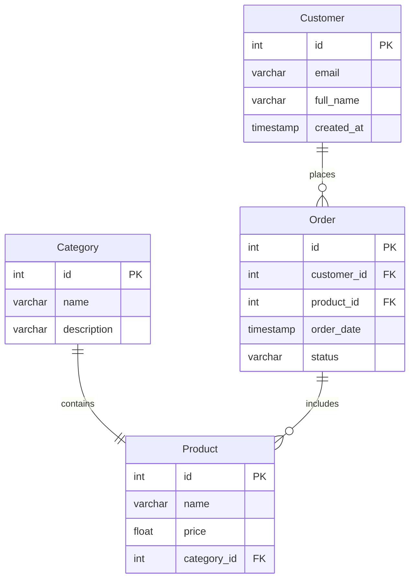

# AI Prompt Trace & Audit

## 1. Prompt
**Промпт:** На основі файлу `spec.md` згенеруй ER-діаграму у форматі Mermaid. Врахуй всі критерії прийняття.

## 2. AI Output (Перша версія)
Модель згенерувала наступний код:

## 3. Топ-3 розбіжності (Аудит)
1. **Помилка типів даних:** ШІ використав фізичні типи SQL (`int`, `varchar`) замість концептуальних (`UUID`, `String`).
2. **Category-Product:** ШІ поставив зв'язок `||--||` (один до одного), хоча має бути один до багатьох.
3. **Order-Product:** ШІ поставив зв'язок `||--o{` (один до багатьох), хоча має бути `||--||`.

## 4. Виправлення 
**Фідбек-коментар:** необхідно зробити критерії в `spec.md` більш жорсткими.
**Додаткова spec:** Додано явну заборону на SQL-типи та додано вимогу використовувати точний синтаксис Mermaid для зв'язків.